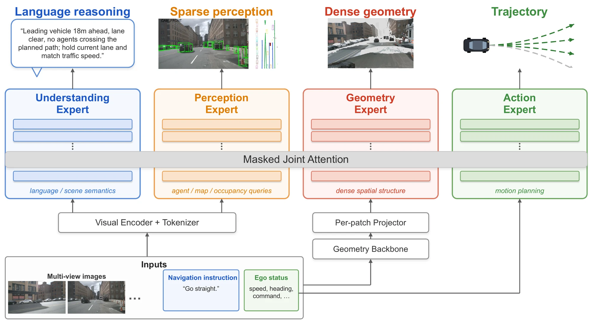

# VLGA: Vision-Language-Geometry-Action Models for Autonomous Driving

[**Project Page**](https://yaojin17.github.io/VLGA/) | [**arXiv**](https://arxiv.org/abs/2606.12396)

---

## 🚧 Code Coming Soon

The code and models for VLGA will be released here. Stay tuned!

VLGA is the first vision-language-action model supervised to reconstruct the dense 3D world it drives through. It introduces geometry as a fourth modality alongside vision, language, and action through a dedicated expert supervised by a per-pixel pointmap regression loss against LiDAR.

  

